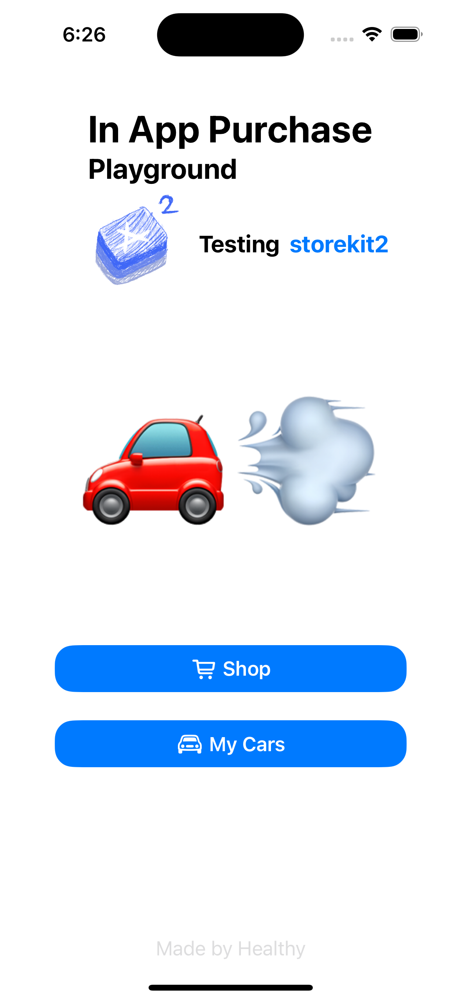

# InAppPurchasePlayground

<div align="center">
  
</div>

## 📖 프로젝트 소개

**InAppPurchasePlayground**는 StoreKit2를 활용하여 인앱 결제 기능을 적용해본 프로젝트 입니다.  
이해한 내용을 Swift Documentation Comments(`///`)를 사용하여 주석과 리드미에 자세하게 써두었습니다.

### 📱 앱 화면 구성

| 메인 화면 | 상점 화면 |
|:---:|:---:|
|  |  |
| 앱의 첫 화면입니다. | 다양한 인앱 구매 상품들을 확인하고 구매할 수 있는 상점 화면입니다. |

| 구매 목록 화면 | 구매한 자동차 화면 |
|:---:|:---:|
|  |  |
| 사용자가 구매한 상품들의 목록을 확인할 수 있는 화면입니다. | 구매한 자동차의 상세 정보를 확인할 수 있는 화면입니다. |

### 🎬 기능 시연

| 비소모성 상품 구매 | 소모성 상품 구매 | 소모성 상품 사용 |
|:---:|:---:|:---:|
|  |  |  |
| 자동차와 같은 비소모성 상품의 구매 과정 입니다. | 연료와 같은 소모성 상품의 구매 과정 입니다. | 구매한 소모성 상품을 실제로 사용하는 과정 입니다. |


## 🏗️ StoreViewModel 함수 흐름

### 1. 앱 시작 시 (초기화 흐름)

```
1. StoreViewModel() init 호출
   ↓
2. loadProductIdToEmojiData() - plist에서 상품 데이터 로드
   ↓
3. listenForTransactions() - 백그라운드에서 트랜잭션 감시 시작
   ↓
4. requestProducts() - App Store에서 상품 정보 가져오기
   ↓
5. 상품들을 타입별로 분류하여 @Published 변수들에 저장
```

### 2. 사용자가 상품 구매 시 (구매 흐름)

```
1. 사용자가 ShopView에서 구매 버튼 클릭
   ↓
2. purchase(product: Product) 호출
   ↓
3. product.purchase() - App Store에 구매 요청
   ↓
4. 구매 결과에 따른 분기:
   
   📌 성공 케이스:
   - checkVerified() - 트랜잭션 검증
   - transaction.finish() - 트랜잭션 완료 처리
   - Transaction 반환
   
   📌 취소/대기 케이스:
   - nil 반환 (구매 완료되지 않음)
```

### 3. 백그라운드 트랜잭션 감시 (자동 처리 흐름)

```
1. listenForTransactions() - Task.detached로 백그라운드 실행
   ↓
2. Transaction.updates 비동기 시퀀스에서 이벤트 대기
   ↓
3. 트랜잭션 이벤트 발생 시:
   - checkVerified() - 트랜잭션 검증
   - transaction.finish() - 트랜잭션 완료 처리
```

**listenForTransactions()가 필요한 이유:**
- **앱 크래시 후 복구**: 구매 진행 중 앱이 종료된 경우 미완료 트랜잭션 처리
- **시스템 레벨 트랜잭션**: 시스템에서 발생하는 트랜잭션 업데이트 감지
- **가족 공유 구매**: 다른 기기에서 구매한 상품의 트랜잭션 동기화

### 4. 앱 종료 시 (정리 흐름)

```
1. deinit 호출
   ↓
2. updateListenerTask?.cancel() - 백그라운드 Task 중단
```

## 📊 함수별 역할 요약

| 함수 | 역할 | 호출 시점 |
|------|------|-----------|
| `init()` | 초기화 및 상품 로드 | 앱 시작 시 |
| `loadProductIdToEmojiData()` | plist 데이터 로드 | init 시 |
| `requestProducts()` | App Store 상품 정보 가져오기 | init 시 |
| `listenForTransactions()` | 백그라운드 트랜잭션 감시 | init 시 |
| `checkVerified()` | 트랜잭션 검증 | 구매 시, 백그라운드 감시 시 |
| `purchase()` | 상품 구매 요청 | 사용자 구매 시 |
| `deinit` | 리소스 정리 | 앱 종료 시 |

## 🔄 주요 흐름의 특징

1. **초기화**: 앱 시작과 동시에 모든 준비 작업이 비동기로 실행
2. **구매**: 사용자 액션에 따른 즉시 처리
3. **백그라운드 감시**: 지속적으로 트랜잭션 상태를 모니터링
4. **자동 완료**: 백그라운드에서 트랜잭션을 자동으로 완료 처리

## 📁 파일 구조

```
InAppPurchasePlayground/
├── App/
│   └── InAppPurchasePlaygroundApp.swift
├── View/
│   ├── ContentView.swift
│   ├── MyCarView.swift
│   └── ShopView.swift
├── ViewModel/
│   └── StoreViewModel.swift
├── Model/
├── Products.plist
└── Products.storekit
```

## 🛠️ 기술 스택

- **SwiftUI** - UI 프레임워크
- **StoreKit2** - 인앱 구매 처리
- **UserDefaults** - 소모성 상품 구매 이력 로컬 저장
- **PropertyListSerialization** - plist 파일 파싱

## 📝 주요 기능

- 소모성 상품 구매
- 비소모성 상품 구매  
- 구독형 상품 구매
- 트랜잭션 자동 감시 및 처리
- plist를 통한 상품 정보 관리
